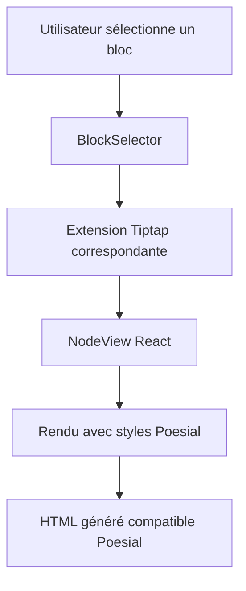

# Design Document - Éditeur Style Poesial

## Overview

Ce document décrit l'architecture technique pour créer un éditeur Tiptap qui reproduit exactement les layouts et le rendu visuel du site Poesial. L'éditeur permettra aux utilisateurs de créer du contenu avec une interface WYSIWYG tout en générant le HTML exact compatible avec le site Poesial.

## Architecture

### Architecture Globale

```
PoesialEditor (Composant Principal)
├── BlockSelector (Interface de sélection)
├── TiptapCore (Éditeur principal)
├── Extensions/ (Extensions personnalisées)
├── NodeViews/ (Composants React pour chaque bloc)
├── Styles/ (CSS du site Poesial)
└── Utils/ (Transformateurs HTML)
```

### Flux de Données



## Components and Interfaces

### 1. PoesialEditor (Composant Principal)

```typescript
interface PoesialEditorProps {
  content?: string;
  onChange: (content: string) => void;
  onExport?: (html: string) => void;
  previewMode?: boolean;
}

interface PoesialEditorState {
  selectedBlockType: BlockType | null;
  isBlockSelectorOpen: boolean;
  currentContent: string;
}
```

### 2. BlockSelector (Interface de Sélection)

```typescript
interface BlockSelectorProps {
  onBlockSelect: (blockType: BlockType) => void;
  onClose: () => void;
  position: { x: number; y: number };
}

type BlockType = 
  | 'fullwidth-image'
  | 'ratio-image' 
  | 'image-grid'
  | 'rich-text'
  | 'testimony'
  | 'text-block'
  | 'video';

interface BlockDefinition {
  type: BlockType;
  name: string;
  description: string;
  icon: React.ReactNode;
  preview: string; // URL ou composant de prévisualisation
  category: 'media' | 'text' | 'layout';
}
```

### 3. Extensions Tiptap

#### FullWidthImageExtension
```typescript
interface FullWidthImageAttributes {
  src: string;
  alt?: string;
  variant: 'auto' | '16-9';
}

declare module '@tiptap/core' {
  interface Commands<ReturnType> {
    fullWidthImage: {
      setFullWidthImage: (attrs: FullWidthImageAttributes) => ReturnType;
    };
  }
}
```

#### ImageGridExtension
```typescript
interface ImageGridAttributes {
  images: Array<{
    src: string;
    alt?: string;
    hasVideo?: boolean;
    videoSrc?: string;
  }>;
  columns: 2; // Fixé à 2 pour Poesial
}
```

#### TestimonyExtension
```typescript
interface TestimonyAttributes {
  quote: string;
  authorName: string;
  authorRole: string;
  authorImage?: string;
}
```

#### RichTextExtension
```typescript
interface RichTextAttributes {
  content: string;
  variant: 'default' | 'about-container';
}
```

### 4. NodeViews React

#### FullWidthImageView
```typescript
interface FullWidthImageViewProps {
  node: Node;
  updateAttributes: (attrs: Partial<FullWidthImageAttributes>) => void;
  deleteNode: () => void;
}
```

#### ImageGridView
```typescript
interface ImageGridViewProps {
  node: Node;
  updateAttributes: (attrs: Partial<ImageGridAttributes>) => void;
  deleteNode: () => void;
}
```

## Data Models

### Block Configuration
```typescript
interface BlockConfig {
  blocks: {
    [K in BlockType]: {
      extension: Extension;
      nodeView: React.ComponentType<any>;
      defaultAttributes: Record<string, any>;
      htmlTemplate: string;
    };
  };
}
```

### HTML Templates
```typescript
interface HTMLTemplates {
  fullWidthImage: (attrs: FullWidthImageAttributes) => string;
  imageGrid: (attrs: ImageGridAttributes) => string;
  testimony: (attrs: TestimonyAttributes) => string;
  richText: (attrs: RichTextAttributes) => string;
}
```

## Styling Strategy

### 1. CSS Architecture
```
styles/
├── poesial-base.css      # Styles de base copiés du site
├── poesial-components.css # Styles des composants spécifiques
├── editor-overrides.css  # Adaptations pour l'éditeur
└── responsive.css        # Styles responsive
```

### 2. CSS Classes Mapping
```typescript
const POESIAL_CLASSES = {
  section: 'section',
  container: 'u-container',
  imageContainer: 'temp-img_container',
  image: 'comp-img',
  richText: 'temp-rich u-color-dark w-richtext',
  testimony: 'temp-comp-testimony',
  imageGrid: 'temp-comp-img_grid',
  // ... autres classes
} as const;
```

## Component Structure

### 1. PoesialEditor Structure
```typescript
export function PoesialEditor({ content, onChange, previewMode }: PoesialEditorProps) {
  const [blockSelectorState, setBlockSelectorState] = useState<BlockSelectorState>();
  
  const editor = useEditor({
    extensions: [
      StarterKit,
      FullWidthImageExtension,
      ImageGridExtension,
      TestimonyExtension,
      RichTextExtension,
      SlashCommandExtension.configure({
        onSlashCommand: handleSlashCommand,
      }),
    ],
    content,
    onUpdate: ({ editor }) => onChange(editor.getHTML()),
  });

  return (
    <div className="poesial-editor">
      {!previewMode && (
        <Toolbar editor={editor} onBlockSelect={handleBlockSelect} />
      )}
      
      <EditorContent 
        editor={editor} 
        className={previewMode ? 'preview-mode' : 'edit-mode'}
      />
      
      {blockSelectorState?.isOpen && (
        <BlockSelector
          {...blockSelectorState}
          onBlockSelect={handleBlockInsert}
          onClose={() => setBlockSelectorState(undefined)}
        />
      )}
    </div>
  );
}
```

### 2. BlockSelector Structure
```typescript
export function BlockSelector({ onBlockSelect, position }: BlockSelectorProps) {
  const blockCategories = useMemo(() => ({
    media: [
      {
        type: 'fullwidth-image',
        name: 'Image Pleine Largeur',
        description: 'Image qui prend toute la largeur',
        icon: <ImageIcon />,
        preview: '/previews/fullwidth-image.png',
      },
      {
        type: 'image-grid',
        name: 'Grille d\'Images',
        description: 'Deux images côte à côte',
        icon: <GridIcon />,
        preview: '/previews/image-grid.png',
      },
    ],
    text: [
      {
        type: 'rich-text',
        name: 'Texte Riche',
        description: 'Bloc de texte avec formatage',
        icon: <TextIcon />,
        preview: '/previews/rich-text.png',
      },
      {
        type: 'testimony',
        name: 'Témoignage',
        description: 'Citation avec profil auteur',
        icon: <QuoteIcon />,
        preview: '/previews/testimony.png',
      },
    ],
  }), []);

  return (
    <div 
      className="block-selector"
      style={{ 
        position: 'absolute',
        left: position.x,
        top: position.y,
      }}
    >
      {Object.entries(blockCategories).map(([category, blocks]) => (
        <BlockCategory
          key={category}
          title={category}
          blocks={blocks}
          onBlockSelect={onBlockSelect}
        />
      ))}
    </div>
  );
}
```

## Error Handling

### 1. Image Upload Errors
```typescript
interface ImageUploadError {
  type: 'size' | 'format' | 'network';
  message: string;
  file?: File;
}

const handleImageUploadError = (error: ImageUploadError) => {
  switch (error.type) {
    case 'size':
      toast.error('Image trop volumineuse (max 10MB)');
      break;
    case 'format':
      toast.error('Format non supporté (JPG, PNG, WebP uniquement)');
      break;
    case 'network':
      toast.error('Erreur de téléchargement, veuillez réessayer');
      break;
  }
};
```

### 2. Content Validation
```typescript
const validatePoesialContent = (html: string): ValidationResult => {
  const errors: string[] = [];
  const warnings: string[] = [];
  
  // Vérifier la structure HTML
  if (!html.includes('u-container')) {
    warnings.push('Contenu sans conteneur principal détecté');
  }
  
  // Vérifier les images
  const images = html.match(/]*>/g) || [];
  images.forEach((img, index) => {
    if (!img.includes('comp-img')) {
      errors.push(`Image ${index + 1} sans classe Poesial`);
    }
  });
  
  return { isValid: errors.length === 0, errors, warnings };
};
```

## Testing Strategy

### 1. Unit Tests
- Tester chaque extension Tiptap individuellement
- Vérifier la génération HTML pour chaque type de bloc
- Tester les transformations de données

### 2. Integration Tests
- Tester l'interaction entre les extensions
- Vérifier le rendu des NodeViews
- Tester l'export HTML final

### 3. Visual Regression Tests
- Comparer le rendu de l'éditeur avec le site Poesial
- Tester sur différentes tailles d'écran
- Vérifier la cohérence des styles

### 4. E2E Tests
```typescript
describe('Poesial Editor E2E', () => {
  it('should create content matching Poesial layout', async () => {
    // 1. Ouvrir l'éditeur
    // 2. Ajouter différents types de blocs
    // 3. Vérifier le HTML généré
    // 4. Comparer avec le site Poesial
  });
});
```

## Performance Considerations

### 1. Lazy Loading
- Charger les NodeViews à la demande
- Lazy loading des images dans l'éditeur
- Code splitting pour les extensions

### 2. Optimisation Images
- Compression automatique des images uploadées
- Génération de thumbnails pour l'éditeur
- Support des formats modernes (WebP, AVIF)

### 3. Memory Management
- Cleanup des event listeners
- Optimisation des re-renders React
- Gestion du cache des images

## Migration Strategy

### Phase 1: Core Infrastructure
1. Setup des extensions de base
2. Implémentation du BlockSelector
3. Styles CSS de base

### Phase 2: Block Types
1. FullWidthImage + NodeView
2. ImageGrid + NodeView
3. RichText + NodeView

### Phase 3: Advanced Features
1. Testimony + NodeView
2. Video support
3. Export/Import functionality

### Phase 4: Polish & Testing
1. Visual regression tests
2. Performance optimization
3. Documentation utilisateur