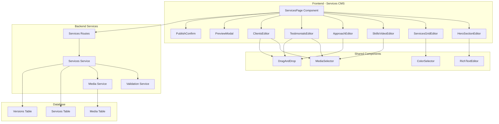
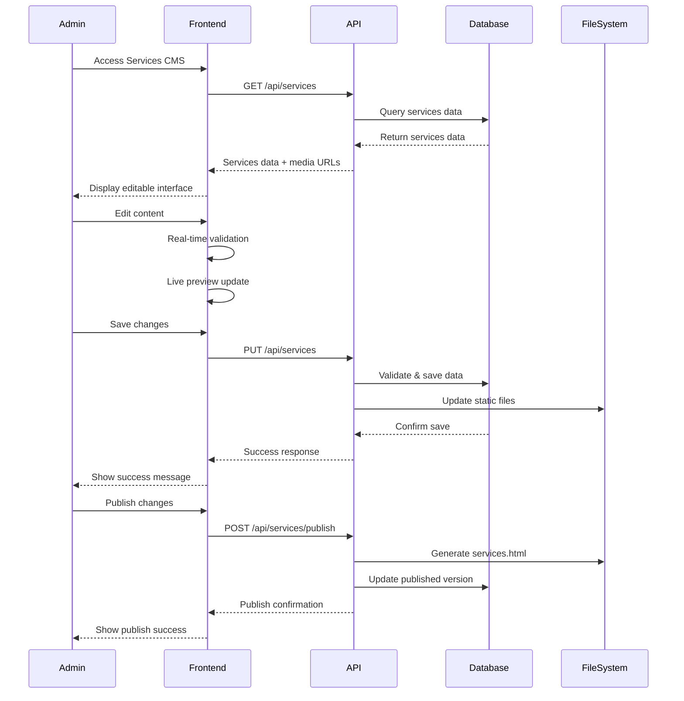

# Design Document - Services Page CMS

## Overview

Le Services Page CMS est un système de gestion de contenu spécialisé pour la page Services du portfolio. Il s'appuie sur l'architecture existante du homepage CMS et étend les fonctionnalités pour gérer les spécificités de la page Services : gestion des compétences, témoignages avec slider, et liste de clients avec logos.

Le système suit les mêmes principes de design que le homepage CMS : interface intuitive, prévisualisation en temps réel, validation robuste, et intégration transparente avec le système de gestion de médias existant.

## Architecture

### System Architecture



### Data Flow Architecture



## Components and Interfaces

### 1. ServicesPage Component

**Purpose:** Container principal pour l'interface d'édition de la page Services

**Props Interface:**
```typescript
interface ServicesPageProps {
  initialData?: ServicesData;
  onSave?: (data: ServicesData) => Promise<void>;
  onPublish?: (data: ServicesData) => Promise<void>;
  isLoading?: boolean;
}
```

**State Management:**
```typescript
interface ServicesPageState {
  data: ServicesData;
  isDirty: boolean;
  isPreviewOpen: boolean;
  isPublishing: boolean;
  validationErrors: ValidationError[];
  activeSection: ServicesSection;
}
```

### 2. HeroSectionEditor Component

**Purpose:** Éditeur pour la section hero avec titre et description

**Props Interface:**
```typescript
interface HeroSectionEditorProps {
  data: HeroSectionData;
  onChange: (data: HeroSectionData) => void;
  errors?: ValidationError[];
}

interface HeroSectionData {
  title: string;
  description: string;
  highlightText?: string; // Pour "17+ years"
}
```

### 3. ServicesGridEditor Component

**Purpose:** Éditeur pour les 3 services avec gestion des couleurs

**Props Interface:**
```typescript
interface ServicesGridEditorProps {
  services: ServiceItem[];
  onChange: (services: ServiceItem[]) => void;
  onReorder: (fromIndex: number, toIndex: number) => void;
  errors?: ValidationError[];
}

interface ServiceItem {
  id: string;
  number: number;
  title: string;
  description: string;
  color: string; // Hex color code
  colorClass: string; // CSS class for styling
}
```

### 4. SkillsVideoEditor Component

**Purpose:** Éditeur pour la section compétences et vidéo

**Props Interface:**
```typescript
interface SkillsVideoEditorProps {
  data: SkillsVideoData;
  onChange: (data: SkillsVideoData) => void;
  errors?: ValidationError[];
}

interface SkillsVideoData {
  description: string;
  skills: SkillItem[];
  ctaText: string;
  ctaUrl: string;
  video: VideoData;
}

interface SkillItem {
  id: string;
  name: string;
  order: number;
}

interface VideoData {
  url: string;
  caption: string;
  autoplay: boolean;
  loop: boolean;
  muted: boolean;
}
```

### 5. ApproachEditor Component

**Purpose:** Éditeur pour les 4 étapes du processus

**Props Interface:**
```typescript
interface ApproachEditorProps {
  steps: ApproachStep[];
  onChange: (steps: ApproachStep[]) => void;
  onReorder: (fromIndex: number, toIndex: number) => void;
  onAdd: () => void;
  onRemove: (id: string) => void;
  errors?: ValidationError[];
}

interface ApproachStep {
  id: string;
  number: number;
  title: string;
  description: string;
  icon?: string; // URL to icon image
}
```

### 6. TestimonialsEditor Component

**Purpose:** Éditeur pour les témoignages avec slider

**Props Interface:**
```typescript
interface TestimonialsEditorProps {
  testimonials: Testimonial[];
  onChange: (testimonials: Testimonial[]) => void;
  onReorder: (fromIndex: number, toIndex: number) => void;
  onAdd: () => void;
  onRemove: (id: string) => void;
  errors?: ValidationError[];
}

interface Testimonial {
  id: string;
  text: string;
  author: {
    name: string;
    title: string;
    company: string;
    avatar: string; // Media URL
  };
  project: {
    name: string;
    image: string; // Media URL
    url?: string; // Link to case study
  };
  order: number;
}
```

### 7. ClientsEditor Component

**Purpose:** Éditeur pour la liste des clients

**Props Interface:**
```typescript
interface ClientsEditorProps {
  clients: ClientItem[];
  onChange: (clients: ClientItem[]) => void;
  onReorder: (fromIndex: number, toIndex: number) => void;
  onAdd: () => void;
  onRemove: (id: string) => void;
  errors?: ValidationError[];
}

interface ClientItem {
  id: string;
  name: string;
  logo: string; // Media URL (SVG preferred)
  description: string;
  industry: string;
  order: number;
  isActive: boolean;
}
```

## Data Models

### Services Data Model

```typescript
interface ServicesData {
  id: string;
  version: number;
  lastModified: Date;
  publishedAt?: Date;
  isPublished: boolean;
  
  hero: HeroSectionData;
  services: ServiceItem[];
  skillsVideo: SkillsVideoData;
  approach: ApproachStep[];
  testimonials: Testimonial[];
  clients: ClientItem[];
  
  seo: {
    title: string;
    description: string;
    keywords: string[];
    ogImage?: string;
  };
}
```

### Database Schema Extensions

```sql
-- Services table
CREATE TABLE services (
  id UUID PRIMARY KEY DEFAULT gen_random_uuid(),
  version INTEGER NOT NULL DEFAULT 1,
  data JSONB NOT NULL,
  is_published BOOLEAN DEFAULT FALSE,
  published_at TIMESTAMP,
  created_at TIMESTAMP DEFAULT NOW(),
  updated_at TIMESTAMP DEFAULT NOW()
);

-- Services versions table for history
CREATE TABLE services_versions (
  id UUID PRIMARY KEY DEFAULT gen_random_uuid(),
  services_id UUID REFERENCES services(id),
  version INTEGER NOT NULL,
  data JSONB NOT NULL,
  created_at TIMESTAMP DEFAULT NOW(),
  created_by UUID -- Reference to user if auth is implemented
);

-- Indexes for performance
CREATE INDEX idx_services_published ON services(is_published);
CREATE INDEX idx_services_versions_services_id ON services_versions(services_id);
```

## Error Handling

### Validation Rules

1. **Hero Section:**
   - Title: Required, max 200 characters
   - Description: Required, max 1000 characters
   - Highlight text: Optional, max 50 characters

2. **Services Grid:**
   - Each service must have title (max 100 chars) and description (max 200 chars)
   - Colors must be valid hex codes
   - Minimum 1 service, maximum 5 services

3. **Skills & Video:**
   - Description: Required, max 500 characters
   - Skills: Minimum 5 skills, maximum 20 skills
   - Video URL: Must be valid URL or uploaded file
   - CTA text and URL: Required if provided

4. **Approach Steps:**
   - Each step must have title (max 100 chars) and description (max 300 chars)
   - Minimum 3 steps, maximum 6 steps
   - Numbers are auto-generated based on order

5. **Testimonials:**
   - Text: Required, max 1000 characters
   - Author name: Required, max 100 characters
   - Author title: Required, max 150 characters
   - Images: Must be valid media files

6. **Clients:**
   - Name: Required, max 100 characters
   - Description: Required, max 300 characters
   - Logo: Must be SVG or PNG format
   - Industry: Required, max 50 characters

### Error Handling Strategy

```typescript
interface ValidationError {
  field: string;
  section: ServicesSection;
  message: string;
  severity: 'error' | 'warning' | 'info';
}

interface ErrorHandlingConfig {
  showInlineErrors: boolean;
  preventSaveOnErrors: boolean;
  autoSaveOnValid: boolean;
  validationDebounce: number; // ms
}
```

## Testing Strategy

### Unit Tests

1. **Component Tests:**
   - Each editor component with various data states
   - Validation logic for all data types
   - Event handling and state updates
   - Error display and recovery

2. **Service Tests:**
   - API endpoints for CRUD operations
   - Data validation and sanitization
   - File generation and publishing
   - Error handling and recovery

3. **Integration Tests:**
   - Full workflow from edit to publish
   - Media integration and optimization
   - Cross-section data consistency
   - Performance under load

### E2E Tests

1. **User Workflows:**
   - Complete editing session with all sections
   - Preview and publish workflow
   - Error recovery scenarios
   - Media upload and management

2. **Browser Compatibility:**
   - Modern browsers (Chrome, Firefox, Safari, Edge)
   - Mobile responsiveness
   - Accessibility compliance
   - Performance benchmarks

### Performance Requirements

1. **Loading Performance:**
   - Initial page load: < 2 seconds
   - Section switching: < 500ms
   - Preview generation: < 3 seconds
   - Publish operation: < 5 seconds

2. **Memory Usage:**
   - Maximum heap usage: < 100MB
   - No memory leaks during extended sessions
   - Efficient image handling and caching

3. **Network Optimization:**
   - Lazy loading of non-critical sections
   - Optimized API payloads
   - Efficient media delivery
   - Caching strategies for static assets

## Security Considerations

### Input Validation

1. **XSS Prevention:**
   - Sanitize all HTML input
   - Escape user-generated content
   - Validate rich text editor output
   - CSP headers for additional protection

2. **File Upload Security:**
   - Validate file types and sizes
   - Scan for malicious content
   - Secure file storage and serving
   - Rate limiting for uploads

3. **Data Integrity:**
   - Validate all API inputs
   - Prevent SQL injection
   - Secure session management
   - Audit trail for changes

### Access Control

1. **Authentication:**
   - Secure login mechanism
   - Session timeout handling
   - Multi-factor authentication support
   - Password policy enforcement

2. **Authorization:**
   - Role-based access control
   - Section-level permissions
   - Audit logging for all actions
   - Secure API endpoints

## Deployment and Maintenance

### Deployment Strategy

1. **Development Environment:**
   - Local development with hot reload
   - Mock data for testing
   - Debug tools and logging
   - Automated testing pipeline

2. **Staging Environment:**
   - Production-like configuration
   - Full integration testing
   - Performance monitoring
   - User acceptance testing

3. **Production Environment:**
   - Blue-green deployment
   - Database migrations
   - Static file optimization
   - Monitoring and alerting

### Maintenance Considerations

1. **Backup and Recovery:**
   - Automated database backups
   - Version history preservation
   - Point-in-time recovery
   - Disaster recovery procedures

2. **Monitoring and Logging:**
   - Application performance monitoring
   - Error tracking and alerting
   - User activity logging
   - System health dashboards

3. **Updates and Patches:**
   - Automated security updates
   - Feature rollout strategies
   - Backward compatibility
   - Migration procedures