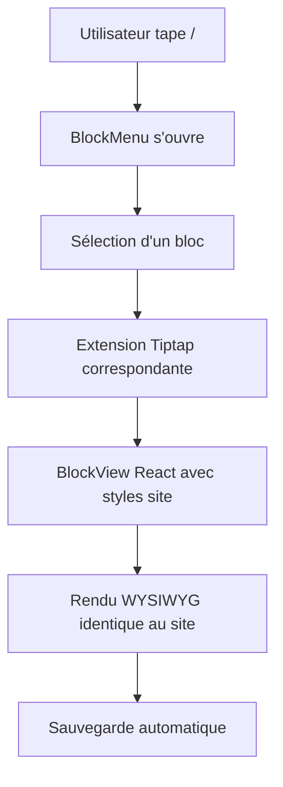

# Design Document - Éditeur Universel Portfolio

## Overview

Ce document décrit l'architecture d'un éditeur Tiptap universel et flexible qui permet de créer n'importe quel type de layout de portfolio. L'éditeur utilise une approche modulaire avec des blocs réutilisables et une interface WYSIWYG qui affiche le rendu exact du site final.

## Architecture

### Architecture Globale

```
UniversalEditor
├── BlockMenu (Interface de sélection)
├── TiptapCore (Éditeur principal)
├── BlockExtensions/ (Extensions modulaires)
├── BlockViews/ (Composants React WYSIWYG)
├── StyleSystem/ (Styles du site intégrés)
└── ContentManager/ (Sauvegarde et export)
```

### Flux de Données Simplifié



## Components and Interfaces

### 1. UniversalEditor (Composant Principal)

```typescript
interface UniversalEditorProps {
  content?: string;
  onChange: (content: string) => void;
  projectId?: string;
  autoSave?: boolean;
}

interface BlockType {
  id: string;
  name: string;
  category: 'media' | 'text' | 'layout';
  icon: React.ReactNode;
  preview: string;
  description: string;
}
```

### 2. BlockMenu (Interface de Sélection)

```typescript
interface BlockMenuProps {
  isOpen: boolean;
  position: { x: number; y: number };
  onBlockSelect: (blockType: string) => void;
  onClose: () => void;
}

const AVAILABLE_BLOCKS: BlockType[] = [
  {
    id: 'image-full',
    name: 'Image Pleine Largeur',
    category: 'media',
    icon: <ImageIcon />,
    preview: '/previews/image-full.png',
    description: 'Image qui prend toute la largeur'
  },
  {
    id: 'image-16-9',
    name: 'Image 16:9',
    category: 'media',
    icon: <ImageIcon />,
    preview: '/previews/image-16-9.png',
    description: 'Image avec ratio 16:9'
  },
  {
    id: 'image-grid',
    name: 'Grille d\'Images',
    category: 'media',
    icon: <GridIcon />,
    preview: '/previews/image-grid.png',
    description: 'Deux images côte à côte'
  },
  {
    id: 'rich-text',
    name: 'Texte Riche',
    category: 'text',
    icon: <TextIcon />,
    preview: '/previews/rich-text.png',
    description: 'Bloc de texte avec formatage'
  },
  {
    id: 'testimony',
    name: 'Témoignage',
    category: 'text',
    icon: <QuoteIcon />,
    preview: '/previews/testimony.png',
    description: 'Citation avec profil auteur'
  },
  {
    id: 'video',
    name: 'Vidéo',
    category: 'media',
    icon: <VideoIcon />,
    preview: '/previews/video.png',
    description: 'Vidéo avec contrôles'
  }
];
```

### 3. Extensions Tiptap Modulaires

#### ImageExtension (Universelle)
```typescript
interface ImageAttributes {
  src: string;
  alt?: string;
  variant: 'full' | '16-9' | 'auto';
  size?: 'small' | 'medium' | 'large';
}

export const ImageExtension = Node.create<ImageOptions>({
  name: 'universalImage',
  
  addAttributes() {
    return {
      src: { default: null },
      alt: { default: null },
      variant: { default: 'auto' },
      size: { default: 'medium' }
    };
  },

  renderHTML({ HTMLAttributes }) {
    const { variant, size } = HTMLAttributes;
    const containerClass = `temp-img${variant === '16-9' ? '' : ' w-variant-e18145a5-28b8-affd-e283-83a4aa5ff6de'}`;
    
    return [
      'div',
      { 
        class: 'section',
        'data-wf--template-section-image--variant': variant 
      },
      [
        'div',
        { class: 'u-container' },
        [
          'div',
          { class: 'temp-img_container' },
          [
            'div',
            { class: containerClass },
            [
              'div',
              { class: 'img-wrp' },
              [
                'img',
                mergeAttributes({
                  class: 'comp-img',
                  'data-wf--template-image--variant': 'radius-16px'
                }, HTMLAttributes)
              ]
            ]
          ]
        ]
      ]
    ];
  }
});
```

#### TextExtension (Universelle)
```typescript
interface TextAttributes {
  content: string;
  variant: 'rich' | 'simple' | 'about';
}

export const TextExtension = Node.create({
  name: 'universalText',
  
  renderHTML({ HTMLAttributes }) {
    const { variant } = HTMLAttributes;
    
    if (variant === 'about') {
      return [
        'section',
        { class: 'section' },
        [
          'div',
          { class: 'u-container' },
          [
            'div',
            { class: 'temp-about_container' },
            // Structure about complète
          ]
        ]
      ];
    }
    
    return [
      'section',
      { class: 'section' },
      [
        'div',
        { class: 'u-container' },
        [
          'div',
          { class: variant === 'rich' ? 'temp-rich u-color-dark w-richtext' : 'temp-comp-text' },
          // Contenu texte
        ]
      ]
    ];
  }
});
```

### 4. BlockViews React (WYSIWYG)

#### ImageBlockView
```typescript
interface ImageBlockViewProps {
  node: Node;
  updateAttributes: (attrs: Partial<ImageAttributes>) => void;
  deleteNode: () => void;
  editor: Editor;
}

export function ImageBlockView({ node, updateAttributes, deleteNode }: ImageBlockViewProps) {
  const { src, alt, variant, size } = node.attrs;
  const [isEditing, setIsEditing] = useState(false);

  const handleImageUpload = (file: File) => {
    const reader = new FileReader();
    reader.onload = (e) => {
      updateAttributes({ src: e.target?.result as string });
    };
    reader.readAsDataURL(file);
  };

  const handleVariantChange = (newVariant: string) => {
    updateAttributes({ variant: newVariant });
  };

  return (
    <NodeViewWrapper>
      <div className={`section ${isEditing ? 'editing' : ''}`} data-wf--template-section-image--variant={variant}>
        <div className="u-container">
          <div className="temp-img_container">
            <div className={`temp-img${variant === '16-9' ? '' : ' w-variant-e18145a5-28b8-affd-e283-83a4aa5ff6de'}`}>
              <div className="img-wrp">
                {src ? (
                   setIsEditing(true)}
                  />
                ) : (
                  <div className="image-placeholder" onClick={() => setIsEditing(true)}>
                    <Upload size="large" />
                    <p>Cliquez pour ajouter une image</p>
                  </div>
                )}
              </div>
            </div>
          </div>
        </div>
        
        {isEditing && (
          <div className="block-controls">
            <input
              type="file"
              accept="image/*"
              onChange={(e) => e.target.files?.[0] && handleImageUpload(e.target.files[0])}
            />
            <select value={variant} onChange={(e) => handleVariantChange(e.target.value)}>
              <option value="auto">Pleine largeur</option>
              <option value="16-9">Ratio 16:9</option>
            </select>
            <button onClick={() => setIsEditing(false)}>Terminé</button>
            <button onClick={deleteNode}>Supprimer</button>
          </div>
        )}
      </div>
    </NodeViewWrapper>
  );
}
```

## Data Models

### Content Structure
```typescript
interface ProjectContent {
  id: string;
  title: string;
  description: string;
  blocks: ContentBlock[];
  metadata: ProjectMetadata;
  createdAt: string;
  updatedAt: string;
}

interface ContentBlock {
  id: string;
  type: string;
  attributes: Record<string, any>;
  content?: string;
  position: number;
}

interface ProjectMetadata {
  client?: string;
  year?: string;
  duration?: string;
  type?: string;
  industry?: string;
  scope?: string[];
}
```

### Block Configuration
```typescript
interface BlockConfig {
  [blockType: string]: {
    extension: Extension;
    view: React.ComponentType<any>;
    defaultAttributes: Record<string, any>;
    category: 'media' | 'text' | 'layout';
    allowedChildren?: string[];
  };
}
```

## Styling Strategy

### 1. Style Integration
```typescript
// Copier les styles exacts du site dans l'éditeur
const SITE_STYLES = `
  .section { /* styles du site */ }
  .u-container { /* styles du site */ }
  .temp-img_container { /* styles du site */ }
  .comp-img { /* styles du site */ }
  .temp-rich { /* styles du site */ }
  /* ... tous les autres styles */
`;

// Injecter dans l'éditeur
const styleSheet = document.createElement('style');
styleSheet.textContent = SITE_STYLES;
document.head.appendChild(styleSheet);
```

### 2. Responsive Design
```css
/* L'éditeur hérite du responsive du site */
@media (max-width: 768px) {
  .temp-comp-img_grid {
    grid-template-columns: 1fr;
  }
  
  .temp-img_container {
    padding: 1rem;
  }
}
```

## Error Handling

### 1. Upload Errors
```typescript
const handleUploadError = (error: UploadError) => {
  switch (error.type) {
    case 'size':
      toast.error('Fichier trop volumineux (max 10MB)');
      break;
    case 'format':
      toast.error('Format non supporté');
      break;
    case 'network':
      toast.error('Erreur de téléchargement');
      break;
  }
};
```

### 2. Content Validation
```typescript
const validateContent = (content: ProjectContent): ValidationResult => {
  const errors: string[] = [];
  
  // Vérifier que chaque bloc a les attributs requis
  content.blocks.forEach((block, index) => {
    if (block.type === 'universalImage' && !block.attributes.src) {
      errors.push(`Image ${index + 1} sans source`);
    }
  });
  
  return { isValid: errors.length === 0, errors };
};
```

## Testing Strategy

### 1. Component Testing
```typescript
describe('ImageBlockView', () => {
  it('should render image with correct styles', () => {
    const mockNode = {
      attrs: { src: 'test.jpg', variant: '16-9' }
    };
    
    render(<ImageBlockView node={mockNode} {...mockProps} />);
    
    expect(screen.getByRole('img')).toHaveClass('comp-img');
    expect(screen.getByTestId('section')).toHaveAttribute(
      'data-wf--template-section-image--variant', 
      '16-9'
    );
  });
});
```

### 2. Integration Testing
```typescript
describe('Universal Editor Integration', () => {
  it('should create content matching site structure', async () => {
    const editor = renderEditor();
    
    // Ajouter différents blocs
    await user.type(editor, '/');
    await user.click(screen.getByText('Image Pleine Largeur'));
    
    // Vérifier la structure HTML générée
    const html = editor.getHTML();
    expect(html).toContain('data-wf--template-section-image--variant="auto"');
    expect(html).toContain('class="comp-img"');
  });
});
```

## Performance Considerations

### 1. Lazy Loading
- Charger les BlockViews à la demande
- Lazy loading des images dans l'éditeur
- Code splitting par type de bloc

### 2. Optimisation Mémoire
- Cleanup automatique des event listeners
- Optimisation des re-renders React
- Gestion du cache des médias

### 3. Auto-save Intelligent
```typescript
const useAutoSave = (content: string, projectId: string) => {
  const debouncedSave = useMemo(
    () => debounce((content: string) => {
      saveProject(projectId, content);
    }, 1000),
    [projectId]
  );

  useEffect(() => {
    if (content) {
      debouncedSave(content);
    }
  }, [content, debouncedSave]);
};
```